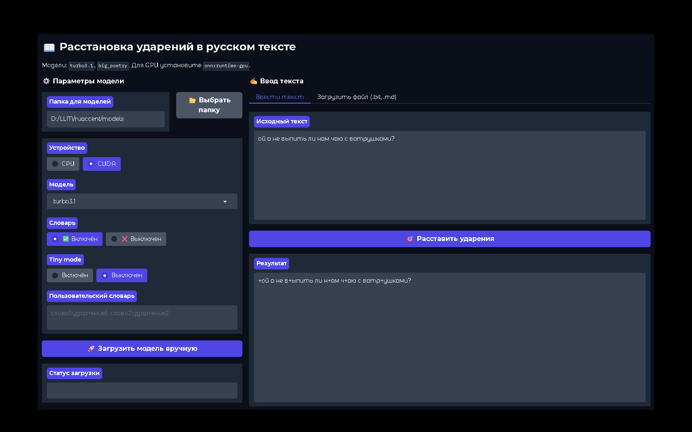

# RUAccent Web Interface — расстановка ударений в русском тексте

### Веб-интерфейс на базе [Gradio](https://gradio.app/) для расстановки ударений в русских текстах
### С использованием библиотеки [RUAccent](https://github.com/Den4ikAI/ruaccent)

- Поддерживает GPU (CUDA), выбор модели (`turbo3.1`, `big_poetry`)
- Постоянное сохранение настроек в браузере.

  


## Возможности

- 🔤 Расстановка ударений в произвольном русском тексте
- 📂 Загрузка текста из файлов `.txt` / `.md`
- 🧠 Две предобученные модели: `turbo3.1` (быстрая) и `big_poetry` (точная)
- 📖 Встроенный словарь омографов (можно отключить)
- 🛠 Пользовательский словарь: задавайте собственные ударения
- 💻 Работа на CPU или GPU (CUDA) через `onnxruntime-gpu`
- 💾 Автоматическое сохранение всех настроек (путь к модели, устройство, словарь) в `localStorage`
- ⚡ Ленивая загрузка модели — ударения расставляются сразу после запуска, без лишних кликов


# ⚡Если у вас есть NVIDIA GPU и вы хотите использовать ускорение:
Обязательно проверьте чтобы у вас была установлена именно gpu-версия
```bash
pip uninstall onnxruntime
pip install onnxruntime-gpu
```

## Установка

1. Клонируйте репозиторий:
```bash
git clone https://github.com/crwg/ruaccent_auto.git
cd ruaccent_auto
```
## Запуск

```bash
python gradio_server.py
